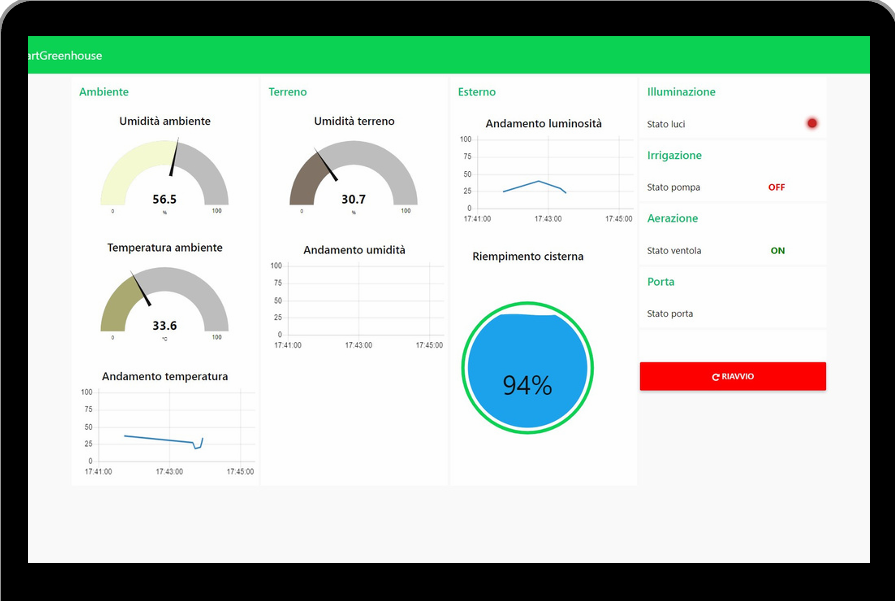

# SmartGreenhouse – IoT Project  

## Overview  
**SmartGreenhouse** is an IoT-based smart garden system designed to monitor and control greenhouse conditions.  
The system integrates environmental and soil monitoring (temperature, humidity, light, and water level) with automated or manual actuation of **irrigation, ventilation, and lighting**.  

A **Node-RED dashboard** provides real-time monitoring, historical data visualization, and remote control through MQTT-based communication. The project also supports remote access via the **Remote-RED mobile app**.  

---

## Project Preview  

Here are some visuals of the implemented system and dashboard:  

### Node-RED Dashboard  
  

### Physical Greenhouse Prototype  
  

---

## Features  
- 🌱 **Irrigation**:  
  - Automatic watering based on soil humidity thresholds set via dashboard.  
  - Manual control of the water pump.  

- 🌬 **Ventilation**:  
  - Automatic fan activation based on configured temperature thresholds.  
  - Manual fan control through dashboard.  

- 💡 **Lighting**:  
  - Adaptive LED lighting control depending on external light levels.  
  - Manual brightness adjustment from dashboard.  

- 📊 **Monitoring & Visualization**:  
  - Local OLED display showing system status.  
  - Node-RED dashboard for remote monitoring and control.  
  - Historical temperature data stored in **InfluxDB** and visualized in dashboard.  
  - Push notifications (via Remote-RED app) when the water tank reaches a critical level.  

---

## Hardware Components  
### Sensors  
- **DHT22** – Ambient temperature and humidity sensor  
- **Soil hygrometer probe** – Soil moisture measurement  
- **HC-SR04 ultrasonic sensor** – Water tank level monitoring  
- **LDR (Light Dependent Resistor)** – External light intensity measurement  
- **Push-button** – Manual input for reset and door control  

### Actuators  
- **LEDs** – Adaptive lighting  
- **DC Fan (5V)** – Greenhouse ventilation  
- **DC Pump (12V)** – Irrigation  
- **Relay module (5V)** – Switching fan and pump  
- **OLED Display (SSD1306)** – Local system status visualization  
- **Servo motor** – Greenhouse door control  

---

## Software Architecture  
- **Firmware (Python for ESP32)**:  
  - Classes for each device (e.g., `Pump`, `Fan`, `Cistern`, `LDR`, `OLED`) abstract sensor/actuator management.  
  - `mqtt_client` class handles **MQTT communication** (connection, publish, subscribe).  
  - Main loop manages automation logic and state publishing.  

- **Node-RED Dashboard**:  
  - Displays sensor readings in real time.  
  - Provides manual control of actuators.  
  - Integrates with InfluxDB for historical data visualization.  
  - Accessible remotely via Remote-RED app.  

---

## Protocols & Communication  
- **MQTT**: Implemented with a cloud-based Mosquitto broker for publish/subscribe communication.  
- **I²C**: Used for communication between ESP32 and OLED display (SSD1306).  
- **Wi-Fi**: ESP32 connectivity for data exchange with MQTT broker and Node-RED.  

---

## Repository Structure  
```bash
├── /src # Python source files (ESP32 firmware)
│ ├── main.py
│ ├── pump.py
│ ├── fan.py
│ ├── ldr.py
│ ├── oled.py
│ └── ...
├── /dashboard # Node-RED dashboard flow
│ └── dashboard.json
└── README.md
```


---

## Getting Started  
### Prerequisites  
- ESP32 microcontroller  
- Node-RED installed locally or on server  
- Mosquitto MQTT broker (cloud or local instance)  
- InfluxDB instance for historical data storage (optional but recommended)  

### Setup Instructions  
1. Flash the ESP32 with the provided Python source files (`/src`).  
2. Import `dashboard.json` into your Node-RED environment.  
3. Configure MQTT broker credentials in both firmware and Node-RED.  
4. (Optional) Connect InfluxDB to store and visualize temperature history.  
5. Use Remote-RED app for mobile access.  

---

## Technologies Used  
- **Python (MicroPython on ESP32)**  
- **Node-RED** (dashboard & control logic)  
- **MQTT (Mosquitto Broker)**  
- **InfluxDB** (time-series data storage)  
- **Remote-RED** (mobile remote access)  
- **I²C communication** (OLED display)  
- **Wi-Fi** connectivity  
